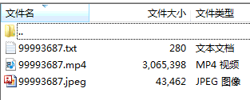
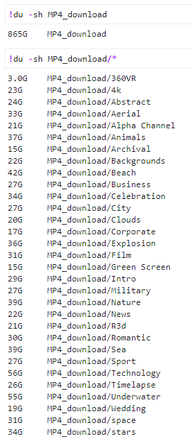
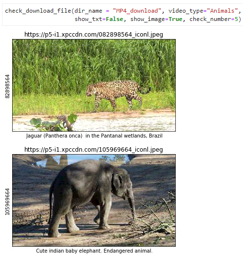
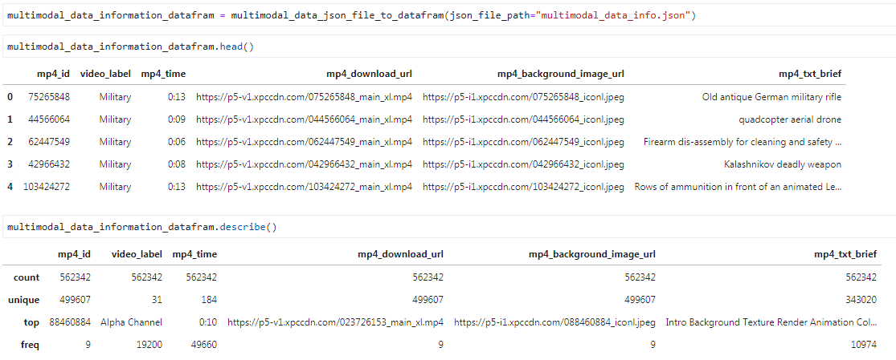
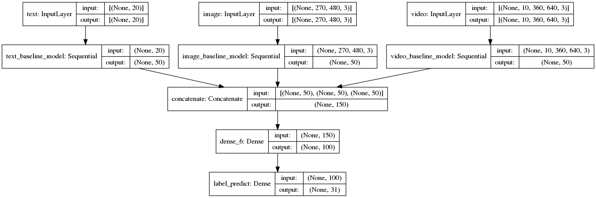
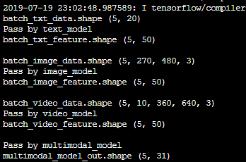

# Multimodal Short Video Data Set and Baseline Classification Model
> If you have data / access to data / better model, please feel free to issue /pull requests / contact me wangzichaochaochao@gmail.com

This resource contains 50+ million(865G) multimodal short video data sets and TensorFlow2.0 multimodal short video classification model, aiming at creating a multimodal classification framework.

Multimodal short video data = short video description text + short video cover image + short video

本资源含有 50+ 万条（865G）多模态短视频数据集和 TensorFlow2.0 多模态短视频分类模型，旨在打造多模态分类框架。

多模态短视频数据 = 短视频描述文本 + 短视频封面图 + 短视频



[click to view example data](example_data)

---

## 1. Multimodal dataset information
The current multimodal short video dataset contains 50+ million multimodal data, covering 31 categories, occupying a total of 865G space. Download and unzip the [multimodal_data_info.rar](aggregate_download_data_to_a_json_file/multimodal_data_info.rar) file and you will get the download address for all datas. You can download them directly using [data_download_tools](data_download_tools), but you can also use your own download tool.

目前多模态短视频数据集含有50+万条多模态数据，它们涵盖31个类别，共占用865G空间。下载并解压 [multimodal_data_info.rar](aggregate_download_data_to_a_json_file/multimodal_data_info.rar) 文件，你可以获得所有数据的下载地址。你可以直接使用 [data_download_tools](data_download_tools) 下载它们，当然你也可以使用自己的下载工具。


### Multimodal data (31 types)

Video category Chinese and English mapping dictionary 视频种类中英文映射字典

```python
video_type_dict = {'360VR': 'VR', '4k': '4K', 'Technology': '科技', 'Sport': '运动', 'Timelapse': '延时',
                   'Aerial': '航拍', 'Animals': '动物', 'Sea': '大海', 'Beach': '海滩', 'space': '太空',
                   'stars': '星空', 'City': '城市', 'Business': '商业', 'Underwater': '水下摄影',
                   'Wedding': '婚礼', 'Archival': '档案', 'Backgrounds': '背景', 'Alpha Channel': '透明通道',
                   'Intro': '开场', 'Celebration': '庆典', 'Clouds': '云彩', 'Corporate': '企业',
                   'Explosion': '爆炸', 'Film': '电影镜头', 'Green Screen': '绿幕', 'Military': '军事',
                   'Nature': '自然', 'News': '新闻', 'R3d': 'R3d', 'Romantic': '浪漫', 'Abstract': '抽象'}

```

In addition to 360VR type video data, each of the other types has approximately 20,000 pieces of data. You can check the contents of all multimodal files at any time using the [download_file_info.ipynb](data_download_tools/xinpianchang/download_file_info.ipynb) tool in [data_download_tools](data_download_tools). As follows:

除了360VR类型的视频数据，其它每个类型有大约20000条数据。你可以使用[data_download_tools](data_download_tools)中的[download_file_info.ipynb](data_download_tools/xinpianchang/download_file_info.ipynb)工具随时检查所有多模态文件的内容，如下所示：

Check the disk space occupied by the data. 检查数据占用的磁盘空间。



Check a type of video cover image and corresponding video description information. 检查某个类型的视频封面图以及对应的视频描述信息。


### multimodal data statistics

The multimodal_data_info.json file contains statistics on 562,342 multimodal data, ```['mp4_id', 'video_label', 'mp4_time', 'mp4_download_url', 'mp4_background_image_url', 'mp4_txt_brief']``` content.

The content of multimodal_data_info.json is as follows:

```python
{"mp4_id": "80328682", "mp4_download_url": "https://p5-v1.xpccdn.com/080328682_main_xl.mp4",
 "mp4_time": "0:16", "mp4_background_image_url": "https://p5-i1.xpccdn.com/080328682_iconl.jpeg",
 "mp4_txt_brief": " Woman in swimsuit and cover up walking at the beach", "video_label": "Beach"}

{"mp4_id": "63660083", "mp4_download_url": "https://p5-v1.xpccdn.com/063660083_main_xl.mp4",
"mp4_time": "0:29", "mp4_background_image_url": "https://p5-i1.xpccdn.com/063660083_iconl.jpeg",
 "mp4_txt_brief": " 4K Happy female friends chatting & drinking on city rooftop in the summer", "video_label": "City"}
```

You can use the [data_analysis.ipynb](aggregate_download_data_to_a_json_file/data_analysis.ipynb) tool in [aggregate_download_data_to_a_json_file](aggregate_download_data_to_a_json_file) to count the data of a multimodal file. The statistics are as follows.

你可以使用[aggregate_download_data_to_a_json_file](aggregate_download_data_to_a_json_file)中的[data_analysis.ipynb](aggregate_download_data_to_a_json_file/data_analysis.ipynb)工具统计多模态文件的数据，统计结果如下所示。



---

## 2. Baseline Classification Model
> 查看我的博客 [短视频分类技术](https://yuanxiaosc.github.io/categories/TF/%E5%95%86%E4%B8%9A%E5%BA%94%E7%94%A8%E6%A1%88%E4%BE%8B/) 获取更多短视频分类信息。

Model structure picture 模型结构图



Model structure test 模型结构测试



[Click on baseline_model to learn more](baseline_model)


### Require

+ python 3+, e.g. python==3.6
+ tensorflow version 2, e.g. tensorflow==2.0.0-beta1
+ tensorflow-datasets

### Train Model

```python
python train_multimodal_baseline_model.py
```

---

## 4. Build your own model

[Click on data_interface_for_model to learn more](data_interface_for_model)

Data can be easily provided to your model using the [data_interface_for_model](data_interface_for_model) data interface. Data_interface_for_model contains three types of data interfaces: tensor required by TensorFlow, numpy required by Pytorch, and native Python type.

可以使用[data_interface_for_model](data_interface_for_model) 数据接口方便的为你的模型提供数据。data_interface_for_model包含三种类型的数据接口，分别是：TensorFlow需要的tensor、Pytorch需要的numpy和原生的Python类型。

---

## 5. Copyright Statement

Currently all multimodal video data comes from the Internet, and the data is copyrighted by the original author. If this data (from https://xinpianchang.com) is used for profit, please contact service@xinpianchang.com to purchase data copyright.

目前所有多模态视频数据来自互联网，该数据版权归原作者所有。如果将该数据（来自 https://xinpianchang.com ）用于牟利，请联系 service@xinpianchang.com 购买数据版权。
